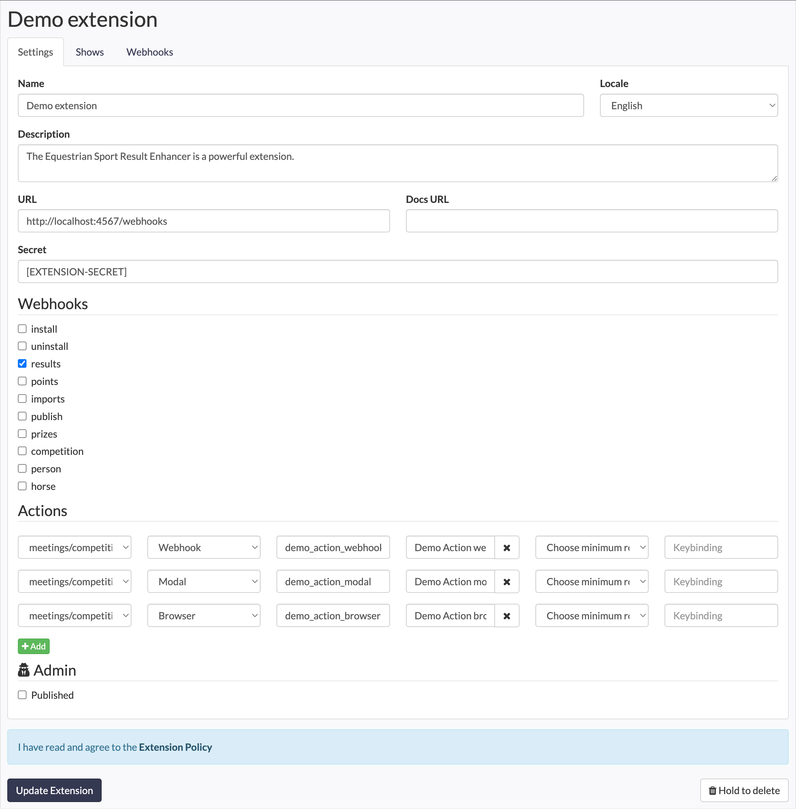
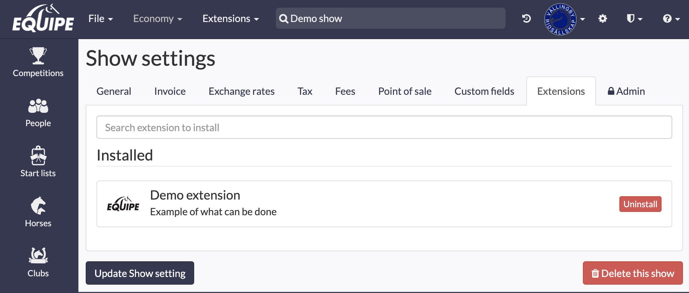
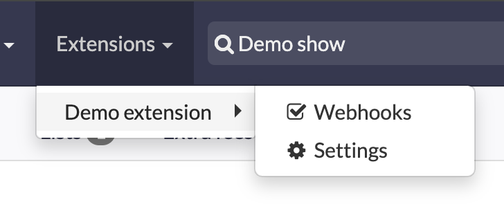

# Extension

Overview how extensions works in Equipe



## Concept

Extensions allow you to create new functionality for Equipe. They can be actions that users access from the menu or in response to specific events within Equipe.

When Equipe triggers a webhook for your extension, you will receive the necessary information to make API calls back to Equipe. This includes the name of the event, an API key for communication with Equipe, and a payload that varies with each event.

Actions can be inserted into various locations within the system as determined by the controller path. The target can be webhook, modal, or browser. A webhook action is triggered like any other event. However, modal and browser actions initiate a GET request and occur in the user's browser. Therefore, we cannot send the event, API key, and payload in clear text since they would be visible to the user.

In this case, we use JWT tokens, which can be decoded using the secret specified in the extension setup.

## Setup

Extensions are created on the Organizer. To navigate, click on the Equipe logo at the top left, then click on **Organizers** and select the organizer you want to add the extension to. You must have been granted the role of developer.

Start by providing the *name* and *description* of the extension. The *Locale* specifies the language that will be used throughout the request.

The *URL* must use HTTPS, as this is the URL to which Equipe will send all requests and webhooks.

*Secret* refers to our shared secret used to encode the JWT token, which you will use to decode it.

Select the webhooks/events to which you want your extension to subscribe.

Add user actions and specify where they should appear in the UI of Equipe

Published extensions are available for everyone, unpublished extensions are available for owners or developers of the organizer and can be added to all shows they have access too.

## Webhooks

In this example of a results event, we provide the API key along with URLs for accessing the start list, judgment, and updating the results.

```json
{
   "event_name": "results",
   "api_key": "[FILTERED]",
   "payload":{
      "current": false,
      "start_id": 1,
      "starts_url": "http://app.equipe.com/meetings/929/competitions/1/H/results.json",
      "updates_url": "http://app.equipe.com/meetings/929/competitions/1/H/results/updates",
      "judgement_url": "http://app.equipe.com/meetings/929/competitions/1/H/judgement.json"
   }
}
```

## Actions

Extensions can provide actions that users can take. It is necessary to define where the action should appear within app.equipe.com. Once defined, you can specify the target of action that should occur. The action can trigger a webhook to the extension directly, display a modal in the Equipe user interface, or navigate to the extension. In the latter two cases, the context of the request is sent in a JSON Web Token (JWT) token, encoded with the secret that was set when the extension was created.

Modal will load in an `<iframe>` so it's important that you extension allow get request and return the header X-Frame-Options: ALLOWALL, and you get all the event data and the api key to talk back to Equipe in the data encoded in the token.

This is example in ruby using the the jwt gem. `EXTENSION_SECRET` is the same as in the setup of the extension in app.equipe.com.

```ruby
@payload, @header = JWT.decode params[:token], ENV['EXTENSION_SECRET']
```

# Install

Go to the overall show settings of a Show, click extensions.



Once installed you can depending on where the actions is added they will appear in the dropmenu *Extensions*.



The Webhooks will toggle on/off the execution of webhooks, if if unticked the extension will be paused.
You can shift+click the name of the extension to quick go to its settings.

## REST API

Create, update and delete resources in Equipe with the given api-key. [Read more](REST.md)

## Batch API

Create or update multiple resources in one requests, and setup relationships based on external ids. [Read more](BATCH.md)

## Examples

Please check the two demo extensions written in Ruby and the minimalist framework Sinatra. [Print events](examples/extension.rb) and [Scrubber](examples/scrubber.rb)

## Policy

When you create your extension to Equipe, you must read and agree the our extension policy.

The main take away is Extensions must not replicate or directly compete with services and features that are already provided by Equipe, including but not limited to online.equipe.com. This ensures that the development of extensions complements our existing offerings rather than creating a conflicting or duplicative experience for our users.

Violation of this policy will result in the rejection or removal of your extension from Equipe's platform.
